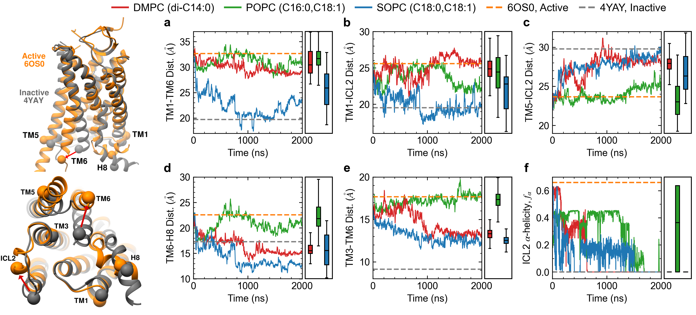

# Figure 1

Caption: Time evolution of apo AT1 receptor simulations in PC membranes of varying chain lengths. Key structural features including the distances between TM1-TM6 (a), TM1-ICL2 (b), TM5-ICL2 (c), TM6-H8 (d) and  TM3-TM6 (e), as well as the alpha-helicity of ICL2 (f) indicate that the active state is stable in the POPC (green lines) membrane, while thicker (SOPC, blue lines) or thinner (DMPC, red lines) membranes promote inactivation. Rectangular boxes on the right of each panel show box and whiskers plots including median, quartiles, and extrema of the combined data from the two replicas of each system over the last 500 ns (n=2 independent simulations, 200,000 time points analyzed). Dashed grey and orange lines show values from crystal structures of the inactive receptor bound to a selective antagonist (4YAY) and active receptor bound to AngII (6OS0) respectively. Inset on the left shows ribbon representations of these structures highlighting the Calpha atoms used to compute distances.

 

*Input data generated from the MD simulations, the python script used to generate the corresponding plot, and the final png image. Each data file has a header that describes each column in the file.*

*Statistical analyses including mean, standard deviation, quartiles, etc. calculated within the python scripts based on the input data files.*
