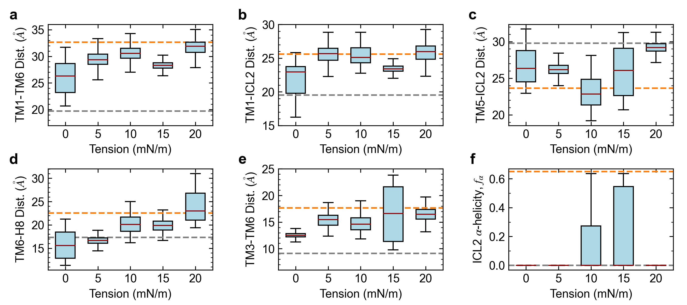

# Figure 2

Caption: Stability of the AT1 receptor in SOPC membranes under tension (5-20 mN/m) starting from an active configuration. Panels a-f show the average intra-protein distances between TM1-TM6, TM1-ICL2, TM5-ICL2, TM6-H8, and TM3-TM6 as well as the alpha-helicity of ICL2 respectively. Values shown as box and whiskers plots including median, quartiles, and extrema of the combined data from the two replicas over the last 500 ns of the 2 us simulations (n=2 independent simulations, 200,000 time points analyzed). Dashed grey and orange lines show values from crystal structures of the inactive receptor bound to a selective antagonist (4YAY) and active receptor bound to AngII (6OS0) respectively. Tensions of 10-15 mN/m are most effective in stabilizing an active-like AT1 receptor configuration.

*This folder contains the input data generated from the MD simulations, the python script used to generate the corresponding plot, and the final png image. Each data file has a header that describes each column in the file.*

*Statistical analyses including mean, standard deviation, quartiles, etc. calculated within the python scripts based on the input data files.*
