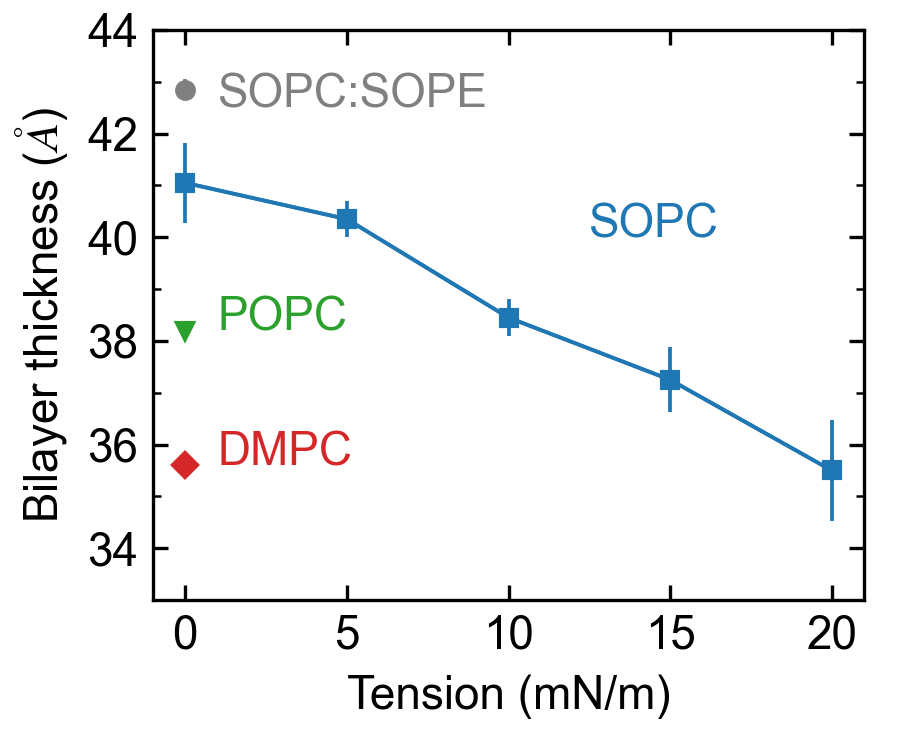

# Figure 3

Caption: Bilayer thickness for different membrane systems. The SOPC bilayer thickness under a tension of 10 mN/m closely matches the value observed for the POPC membrane without tension. Bilayer thickness was computed by measuring the peak-to-peak distance of the average bilayer mass density over the last 500 ns of the two replicas (n=2 independent simulations, 200,000 time points analyzed). Error bars show the standard deviation from the mean. Data shown for DMPC (red diamond), POPC (green triangle),  SOPC with and without tension (blue squares), and SOPC:SOPE (grey circle).

*This folder contains the input data generated from the MD simulations, the python script used to generate the corresponding plot, and the final png image. The bilayer thickness data and estimated errors are included directly in the python script.*
