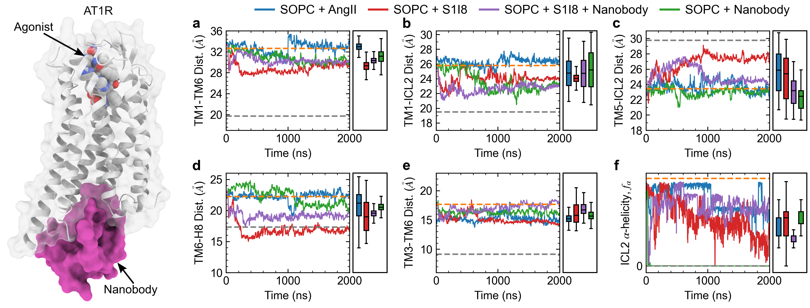

# Figure 5

Caption: Time evolution of AT1 receptor simulations in SOPC bound to the agonists AngII and S1I8 as well as the AT110i1 nanobody. Panels a-f show the AT1 receptor intra-protein distances between TM1-TM6, TM1-ICL2, TM5-ICL2, TM6-H8, and TM3-TM6, as well as the alpha-helicity of ICL2 respectively. Rectangular boxes on the right of each panel show box and whiskers plots including median, quartiles, and extrema of the combined data from the two replicas of each system over the last 500 ns (n=2 independent simulations, 200,000 time points analyzed). Dashed grey and orange lines show values from crystal structures of the inactive receptor bound to a selective antagonist (4YAY) and active receptor bound to AngII (6OS0) respectively. Only the simulation of AT1 receptor with AngII bound (blue lines) remains stable near the active state configuration, while other combinations of AT1R with S1I8 (red lines), AT1R with S1I8 and nanobody (purple lines), and AT1R with nanobody only (green lines) adopt intermediate conformations.

*This folder contains the input data generated from the MD simulations, the python script used to generate the corresponding plot, and the final png image. Each data file has a header that describes each column in the file.*

*Statistical analyses including mean, standard deviation, quartiles, etc. calculated within the python scripts based on the input data files.*
