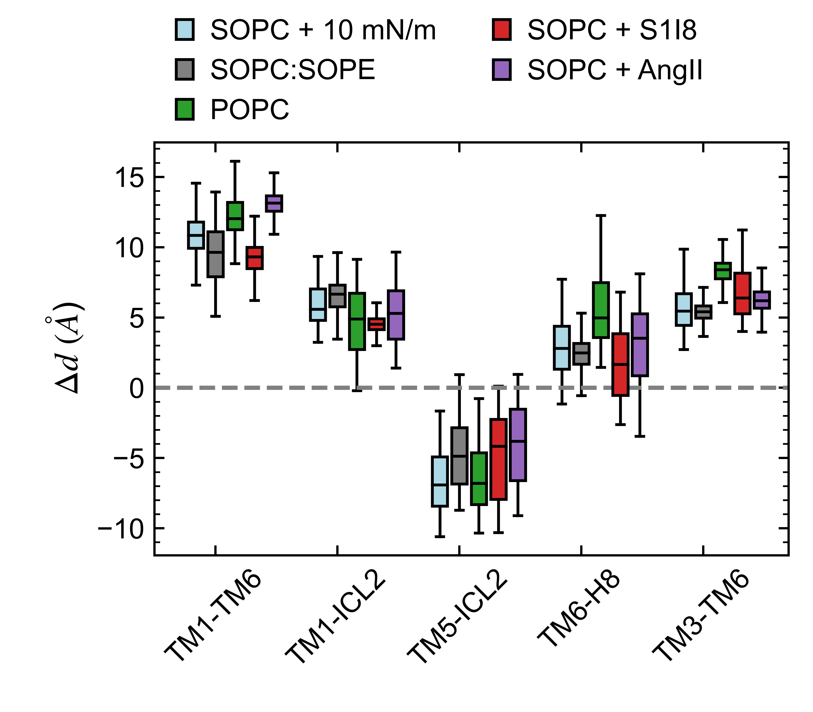

# Figure 6

Caption: Change in intra-helical distances between active and inactive states, Delta d = d_{active}-d_{inactive}, for AT1 receptor in SOPC with no agonist bound and 10 mN/m tension (light blue), in SOPC:SOPE (gray), in POPC (green), in SOPC with S1I8 bound (red), and in SOPC with AngII bound (purple). Values shown as box and whiskers plots including median, quartiles, and extrema of the combined data from the two replicas over the last 500 ns of the 2 us simulations (n=2 independent simulations, 200,000 time points analyzed). The 4YAY crystal structure of the AT1 receptor with a selective antagonist bound was used as the reference inactive structure.

*This folder contains the input data generated from the MD simulations, the python script used to generate the corresponding plot, and the final png image. Each data file has a header that describes each column in the file.*

*Statistical analyses including mean, standard deviation, quartiles, etc. calculated within the python scripts based on the input data files.*
