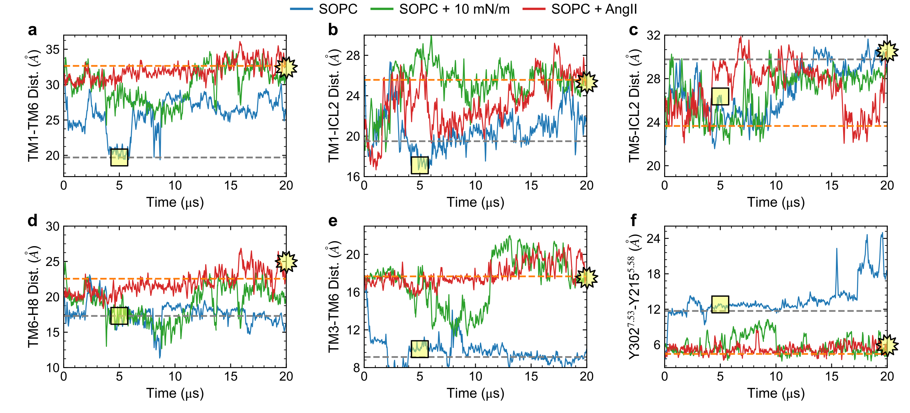

# Figure 8

Caption: Long time-scale (20 us) evolution of select AT1 receptor systems simulated with the CHARMM36 FF on the Anton 2 supercomputer. Data for apo receptor in a tensionless SOPC shown in blue, in SOPC with 10 mN/m tension shown in green, and in SOPC with AngII bound shown in red. Panels a-f show the intra-protein distances between TM1-TM6, TM1-ICL2, TM5-ICL2, TM6-H8, TM3-TM6, and Y302 (7.53)-Y215 (5.58) (NPxxY motif) respectively. Dashed grey and orange lines show values from crystal structures of the inactive receptor bound to a selective antagonist (4YAY) and active receptor bound to AngII (6OS0) respectively. Square and star yellow symbols highlight the values of the distances for the inactive apo system at t=5 us and active AngII bound system at t=20 us that are shown in Fig. 9.}

*This folder contains the input data generated from the MD simulations, the python script used to generate the corresponding plot, and the final png image. Each data file has a header that describes each column in the file. Some labels added to png image manually after generation with the python script.*
