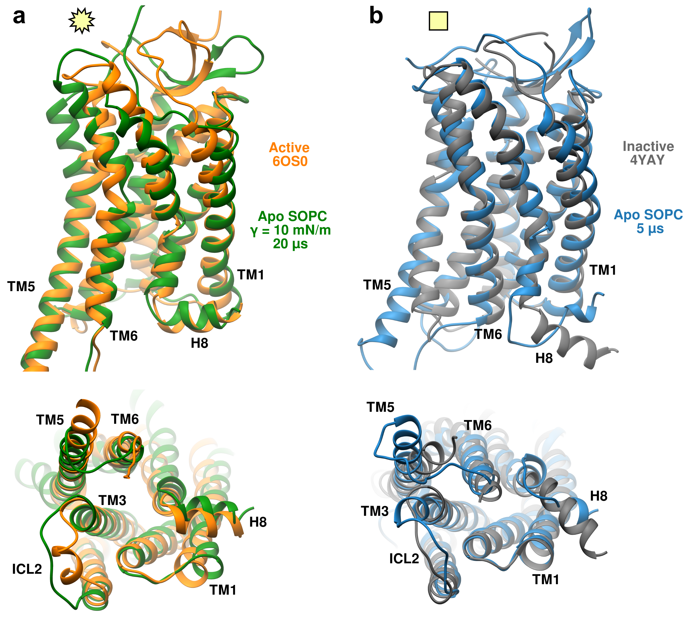

# Figure 9

Caption: Ribbon representations of long time-scale simulations of the apo AT1 receptor in SOPC membranes using the CHARMM36 FF on the Anton 2 supercomputer. a) Structure after 20 us with a tension of 10 mN/m compared to the active state crystal structure (PDBID: 6OS0, with AngII-bound). b) Structure after 5 us with no tension compared to inactive state crystal structure (PDBID: 4YAY, with antagonist-bound). Structures superimposed by minimizing the RMSD distance.

*Image generated using UCSF Chimera based on the PDB structures found in the `structures` folder.*