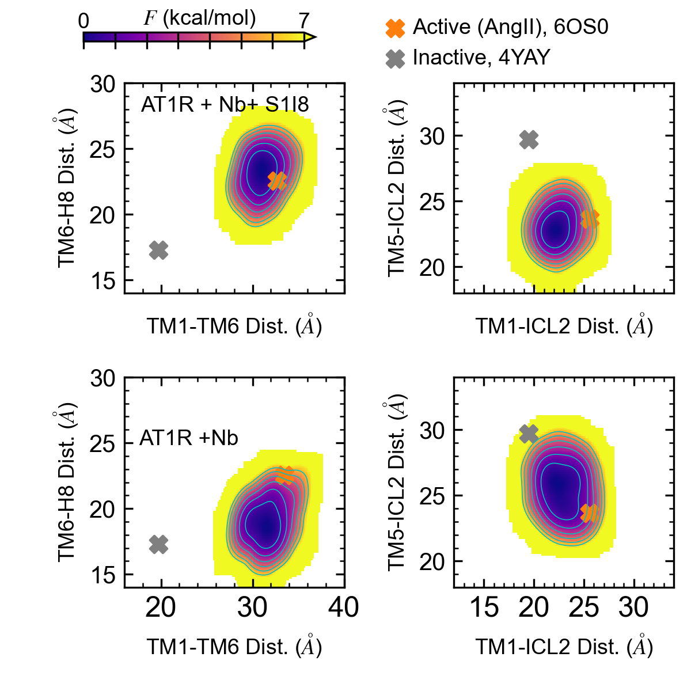

# Supplementary Figure 13

Caption: Free energy estimation of AT1 receptor in SOPC membrane with a) S1I8 and nanobody (Nb) bound, and b) with only nanobody bound. Free energy estimated with LDT multiple-walker well-tempered metadynamics and plotted as two dimensional surfaces through histogram re-weighting using the TM1-TM6, TM6-H8, TM1-ICL2, and TM5-ICL2 distances (see Methods). Energy scale shown on top left with lowest values shown in dark blue and highest values shown in yellow (> 7 kcal/mol). Isocontour lines shown in cyan color drawn in 1 kcal/mol intervals. Grey markers show distance values from the inactive state crystal structure with receptor bound to a selective antagonist (PDBID: 4YAY) and orange markers show distance values from the active state crystal structure with bound AngII (PDBID: 6OS0).

*This folder contains the input data generated from the MD simulations, the python script used to generate the corresponding plot, and the final png image. Each data file has a header that describes each column in the file.*

*Statistical analyses including mean, standard deviation, quartiles, etc. calculated within the python scripts based on the input data files.*
