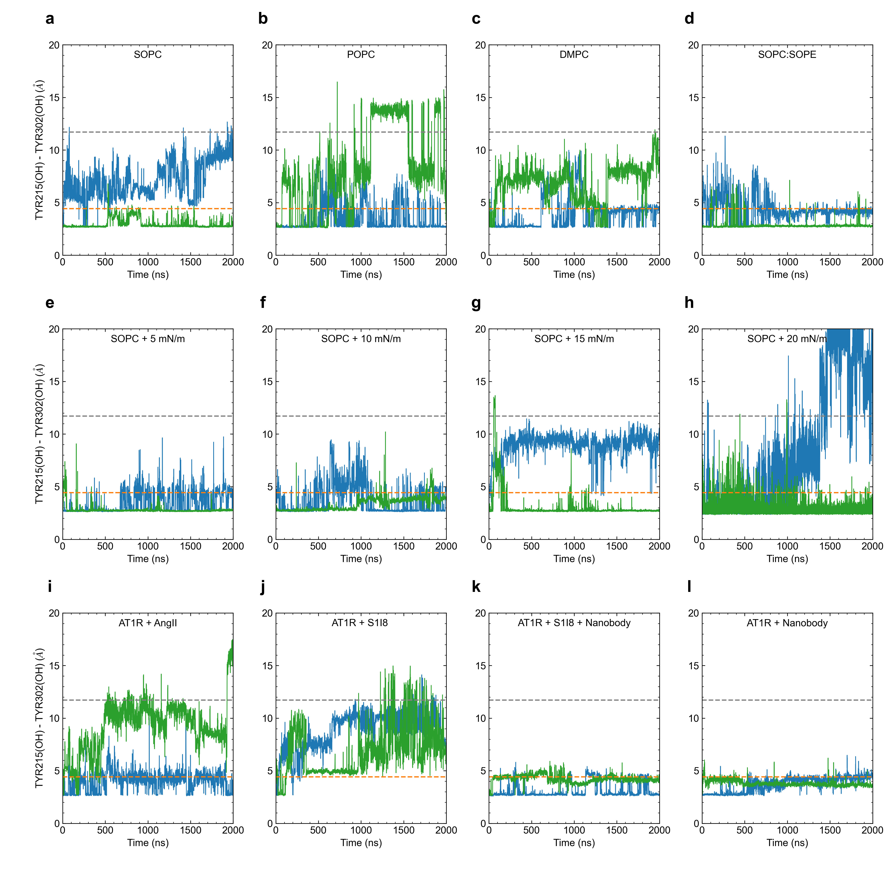

# Supplementary Figure 3

Caption: Orientation of the conserved NPxxY motif in TM7 monitored by the distance between the hydroxyl oxygens of Y215 (5.58) and Y302 (7.53). Top row panels (a-b) show distances for the SOPC, POPC, DMPC, and SOPC:SOPE systems. Middle panels (e-h) show distances for SOPC bilayers under tension. Bottom row panels (i-l) show distances for systems with the AT1 receptor bound to agonists and/or nanobody. The blue and  green lines represent the two simulated replicas.

*This folder contains the input data generated from the MD simulations, the python script used to generate the corresponding plot, and the final png image. Each data file has a header that describes each column in the file.*

*Statistical analyses including mean, standard deviation, quartiles, etc. calculated within the python scripts based on the input data files.*
