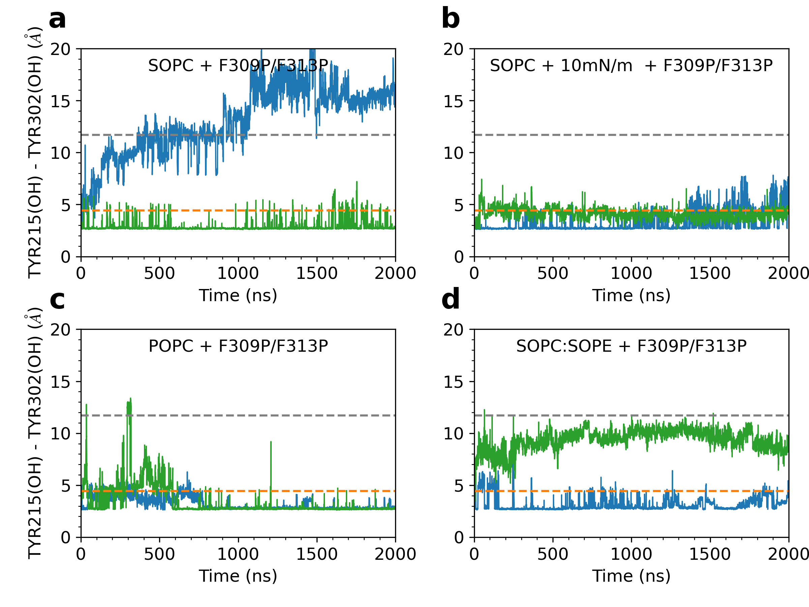

# Supplementary Figure 9

Caption: Orientation of the conserved NPxxY motif in TM7 monitored by the distance between the hydroxyl oxygens of Y215 (5.58) and Y302 (7.53). Data for two replicas (blue and green) of the double-mutant F309P/F313P in SOPC (a), SOPC with 10 mN/m tension (b), POPC (c), and SOPC:SOPE (d).

*This folder contains the input data generated from the MD simulations, the python script used to generate the corresponding plot, and the final png image. Each data file has a header that describes each column in the file.*

*Statistical analyses including mean, standard deviation, quartiles, etc. calculated within the python scripts based on the input data files.*
